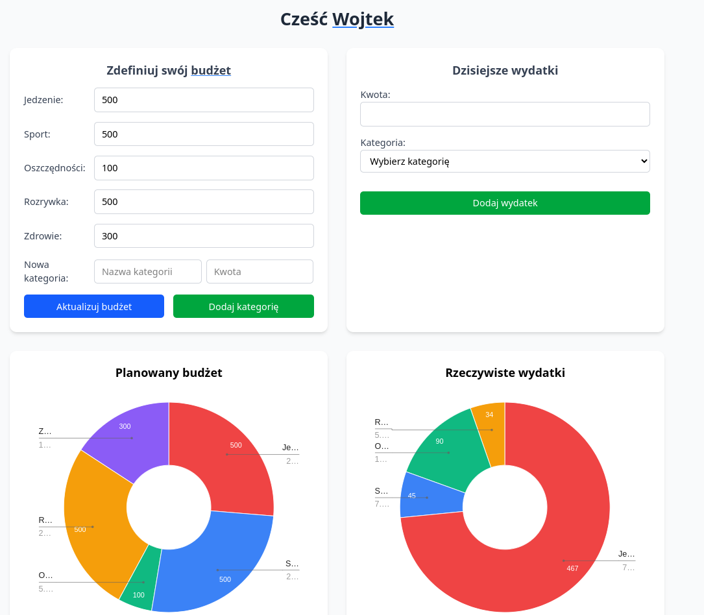
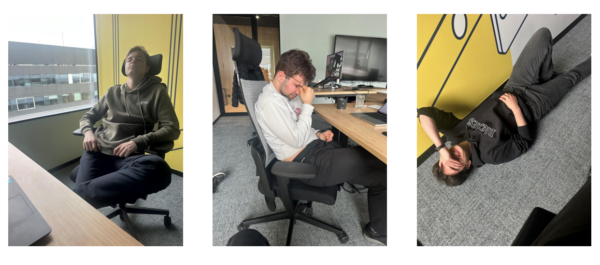

> Projekt powstał na hackatonie w SWM, temat: Ekonomia i Ekologia

Nie było łatwo co widać na ostatnim obrazku...

# Apka do zarządzanie wydatkami:
1. Definiowanie kategorii wydatków oraz maksymalnego budżetu na każdy z nich
2. Dodawanie poszczególnych wydatków, analiza kosztów, informowanie o nierozsądnych zakupach
3. Szacowanie miesięcznych oszczędności na podstawie dochodów oraz trendu wydatków

# Dashboard

# Technologie
## Frontend
- React.js
- Tailwind.css

## Backend
- Spring Boot, Web
- JPA, Hibernate, MySQL

# Autorzy

Od lewej: Filip, Wojtek, Ariel 